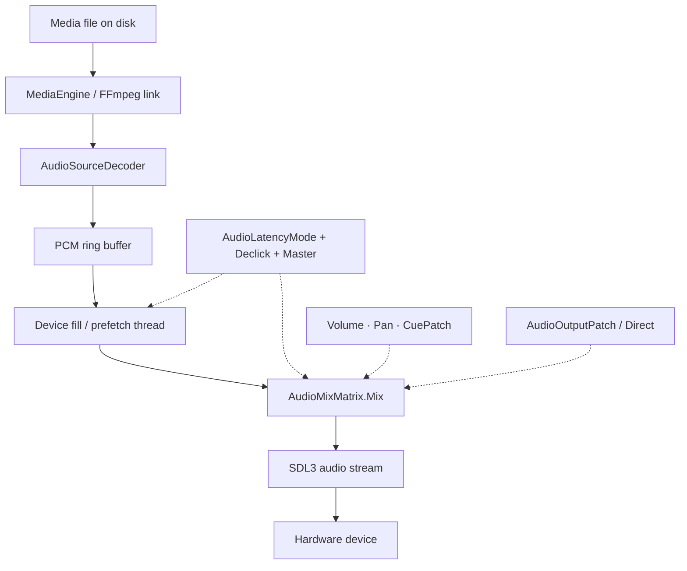

# Technical — Audio signal path

## Goals

Document the real path samples take in Cue2 so systems engineers can reason about latency, load, and failure modes.

## Non-goals

This is not a C# API reference. Class names are anchors for maintainers reading the open-source tree.

## Pipeline overview



## Stages

### 1. Library load

At startup, `MediaEngine` dynamically loads FFmpeg shared libraries (`avutil`, `avcodec`, `avformat`, `swresample`, `swscale`) from platform-specific native paths. Failure here disables decode for the session.

### 2. Decode

`AudioSourceDecoder` (FFmpeg) produces interleaved float PCM for the assigned stream. Open/seek triggers **prefetch** of `PrefetchMs` milliseconds of audio into the ring.

### 3. Ring buffer

`PcmRingBuffer` holds decoded audio ahead of the device. Capacity follows [recommended ring ms](./playback-preferences.md). Producers (decode) and consumers (fill) coordinate so Prefer stability does not overflow a too-small ring.

### 4. Mix

For each fill quantum, `AudioMixMatrix.Mix`:

1. Clears the output buffer for the device stream.  
2. Applies **master × component volume**.  
3. Applies **equal-power pan** when `inChannels == 2`.  
4. Applies optional **cue routing matrix**.  
5. Applies **patch device mapping** or direct routing.  

Multiple active cues sum into shared device streams.

### 5. Present

SDL streams maintain a **target queue depth** (`TargetBufferMs`). When queued audio falls below **low-water** (`LowWaterMs`), the fill path refills from the ring. Underruns produce glitches — raise latency mode or reduce CPU contention.

### 6. Embedded video audio

Video components with embedded audio reuse the same present tuning and mix rules via the video playback audio path (`IAudioPlayback` implementers).

## Latency budget (conceptual)

```text
decode prefetch  +  ring slack  +  SDL target buffer  +  device/OS buffer
```

Cue2 exposes the middle terms via latency mode; OS/device buffers are outside the app.

## Related modules

| Concern | Source areas |
|---------|----------------|
| Mix math | `src/Media/Audio/AudioMixMatrix.cs` |
| Ring | `src/Media/Audio/PcmRingBuffer.cs` |
| Tuning | `src/Domain/Settings/AudioPlaybackPrefs.cs` |
| Playback | `src/Domain/Playback/ActiveAudioPlayback.cs` |
| Devices | `src/Services/AudioDevices.cs` |

## Related

- [Decode & buffers](./technical-decode-and-buffers.md)  
- [Mixing engine](./technical-mixing.md)  
