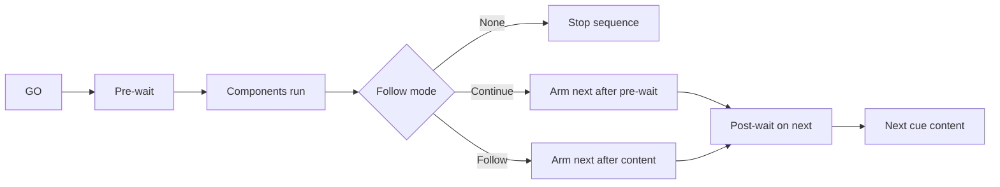

# Concepts in five minutes

## Session and showfile

A **session** is the live show you edit and run. When you save, Cue2 writes a **`.c2` showfile** containing the cuelist, show settings (patches, canvas, OSC/MIDI maps, defaults), and references to media paths.

App-only preferences (keyboard shortcuts, language) stay on the machine under user data — they are **not** stored in the showfile and are **not** on the undo stack.

## Cuelist

The **cuelist** is the ordered list of cues in the main window. You select cues here, GO the playhead selection, nest groups, and multi-edit shells when multi-edit is enabled.

## Cue (shell)

A **cue** is a **shell**: identity and timing that wrap content.

Typical shell fields:

| Field | Role |
|-------|------|
| **Number** | Operator-facing cue number (string; not the same as internal id) |
| **Name** | Label |
| **Colour** | Strip colour in the list |
| **Pre-wait** | Delay after GO before content starts |
| **Duration** | Content duration (derived from components / children when applicable) |
| **Post-wait** | Delay used by Continue / Follow sequencing |
| **Follow mode** | None, Continue, or Follow — see [Cue sequences](../fundamentals/cue-sequences.md) |
| **Armed** | When disarmed, GO skips content and advances |
| **Notes / Memo** | Operator notes; memo layout can replace the standard shell row |

Each cue also has an internal numeric **id** used by OSC, control targets, and save data.

## Components

**Components** are the work the cue does: play audio, show video, send OSC, and so on. **One cue can hold multiple components** of different types. They share the shell’s waits and follow behaviour.

| Type | Purpose |
|------|---------|
| Audio | File playback through patches / devices |
| Video | Movie or still image on a target layer |
| Text | Overlay text on a target layer |
| OSC | Send a message on a named connection |
| MIDI output | Send Note/CC/Program on a session device |
| Control | GO/stop/fade/seek another cue or move a layer |
| Cue light | Drive a configured cue-light device |

See [Component types](../reference/component-types.md).

## Playhead and selection

- **Selection** is which cue(s) are highlighted for editing and for “selected” transport/OSC actions.
- The **playhead** concept is the cue that will receive a standard **GO** from the space bar / GO control (typically the selected standby cue in list order).

Exact playhead advancement after GO respects **armed** and **skip if disarmed**. See [Armed & status](../reference/armed-and-status.md).

## GO and active cues

**GO** starts the selected cue’s sequence: pre-wait → content → (optional) chain to the next sibling via Continue/Follow. Running instances appear in the **active cues** area so you can monitor and stop them.

Playback transport (GO, stop, pause) is **not** recorded in undo history. Editing the document is.

## Show settings vs preferences

| Scope | Examples | Undo? | In `.c2`? |
|-------|----------|-------|-----------|
| Show settings | Patches, canvas, OSC/MIDI input maps, latency mode | Yes (scoped) | Yes |
| App preferences | Keyboard Input Map, locale | No | No |

## Diagram

## Related

- [Cues](../fundamentals/cues.md)
- [Timing model](../fundamentals/timing.md)
- [Playback & transport](../fundamentals/playback-transport.md)
- [Zero to audio](../tutorials/zero-to-audio.md)
