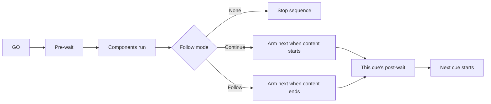

# Concepts in five minutes

## Session and showfile

A **session** is the live show you edit and run. When you save, Cue2 writes a **`.c2` showfile** containing the cuelist, show settings (patches, canvas, OSC/MIDI maps, defaults), and references to media paths.

App-only preferences (keyboard shortcuts, language, UI scale) stay on the machine under user data — they are **not** stored in the showfile and therefore persist between sessions.

## Cuelist

The **cuelist** is the ordered list of cues in the main window. You select cues here, GO the playhead selection, nest groups, and multi-edit shells when multi-edit is enabled.

## Cue (shell)

A **cue** is a **shell** plus the **components** it holds. The shell is the container: identity, timing, armed state, and triggers. It is not itself a type such as audio or video. The cuelist shows shells; components live inside them.

What the shell defines:

| Field | Role |
|-------|------|
| **Number** | Operator-facing cue number (string; not the same as the internal id). Does not need to be unique. |
| **Name** | Label. Does not need to be unique. |
| **Colour** | UI colour in the list and active cue. Useful for visual grouping. |
| **Pre-wait** | Delay after GO before content starts |
| **Duration** | Content duration (derived from components / children when applicable) |
| **Post-wait** | Delay used by Continue / Follow sequencing |
| **Follow mode** | None, Continue, or Follow — see [Cue sequences](../fundamentals/cue-sequences.md) |
| **Armed** | When disarmed, GO does not trigger cue content |
| **Skip if disarmed** | When disarmed, the playhead skips this cue instead of standing on it |
| **Notes** | Operator notes |
| **Memo** | When enabled, the list row becomes a single notes field instead of the standard shell layout |

Each cue also has an internal numeric **id**. This is an immutable unique identifier assigned to the cue and can be referenced by OSC and control components to target that specific cue. The id is shown in the [Shell inspector](../fundamentals/inspector.md).

## Components

**Components** are the work the cue does: play audio, show video, send OSC, and so on. **One shell can hold multiple components** of different types. When a cue is triggered it runs those components according to the shell’s timing and armed state.

Mixed-type cues are supported, but it is best practice to keep one component type per shell for showfile clarity. Group related cues instead.

| Type | Purpose |
|------|---------|
| Audio | File playback through patches / devices |
| Video | Movie or still image on a target layer |
| Text | Overlay text on a target layer |
| OSC | Send a message on a named connection |
| MIDI output | Send Note/CC/Program on a session device |
| Control | GO/stop/fade/seek another cue or move a layer |
| Cue light | Drive a configured cue-light device |

See [Component types](../reference/component-types.md).

## Playhead and selection

- **Selection** is which cue(s) are highlighted for editing and for “selected” transport/OSC actions.
- The **playhead** is the cue that will receive a standard **GO** from the space bar / GO control (typically the selected standby cue in list order).

Exact playhead advancement after GO respects **armed** and **skip if disarmed**. See [Armed & status](../reference/armed-and-status.md).

## GO and active cues

**GO** starts the selected cue’s sequence: pre-wait → content → (optional) chain to the next sibling via Continue/Follow. Running instances appear in the **active cues** area so you can monitor and stop them.

## Grouping

Shells nest in parent/child relationships. Any shell can be reordered as a child of another shell. Triggering a parent also starts its children (and their children) when the parent’s content phase begins. If you GO a child, the playhead moves to its next sibling. If that child is the last in the group, the playhead walks out to the next cue after the parent.

Continue/Follow still chain to the **next sibling at the same nesting level**. See [Groups](../fundamentals/groups.md).

## Diagram

## Related

- [Cues](../fundamentals/cues.md)
- [Groups](../fundamentals/groups.md)
- [Timing model](../fundamentals/timing.md)
- [Playback & transport](../fundamentals/playback-transport.md)
- [Zero to audio](../tutorials/zero-to-audio.md)
