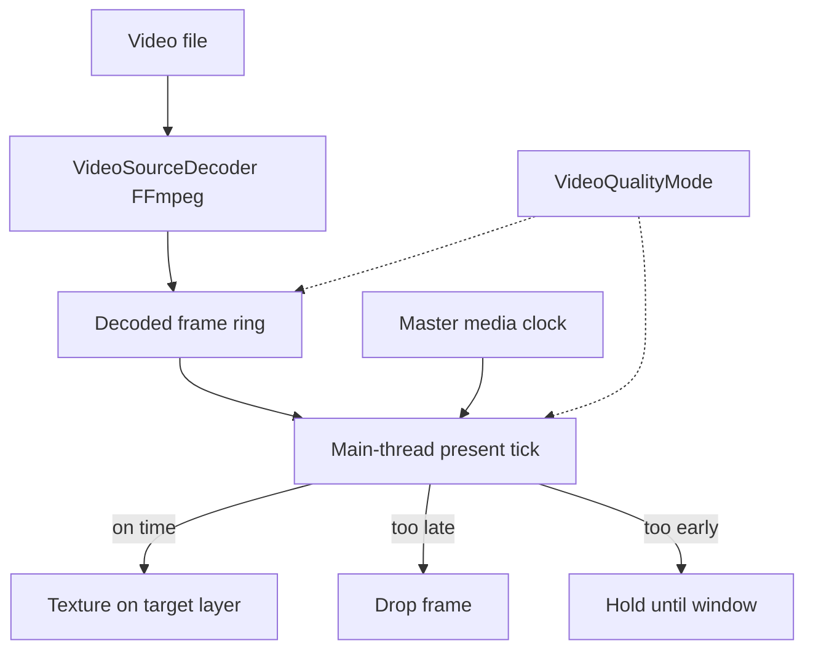

# Technical — Video decode and present

## Pipeline

## Decode

`VideoSourceDecoder` produces `VideoFrame` objects (pixel data + timestamps). Prefetch aims for `PrefetchTarget` buffered frames and refills under `PrefetchLowWater`.

## Master clock

Presentation compares frame timestamps to a **master media clock** for that playback instance (not wall time). Seek retargets the clock and flushes/reprefetches.

## Present tick

On the main thread (Godot frame), the player may present or drop up to **MaxPresentPerTick** frames:

1. Drop frames later than **MaxLatenessUs**.  
2. Present frames within **PresentEarlyToleranceUs** early.  
3. Otherwise wait for the next tick.  

This bounds UI stalls while allowing catch-up after hitches.

## Tuning table

See [Output preferences](./output-preferences.md) for numeric defaults from `VideoPresentTuning.ForMode`.

## Embedded audio clock

When video carries audio, A/V sync policy follows the active video playback implementation — treat video clock as authoritative for picture; audio path uses its own ring/fill with shared start/seek points.

## Failure modes

| Symptom | Mechanism |
|---------|-----------|
| Stutter | Prefetch too small; disk/CPU; raise quality mode |
| High latency | Prefer quality + vsync; large rings |
| Tearing | VSync off |
| Black | Wrong/missing layer; opacity 0; decoder error |

## Related modules

| Concern | Source areas |
|---------|----------------|
| Present tuning | `VideoPlaybackPrefs.cs` |
| Playback | `ActiveVideoPlayback.cs` |
| Decoder | `VideoSourceDecoder.cs` |
| Engine | `MediaEngine.cs` |

## Related

- [Display graph](./technical-display-graph.md)  
